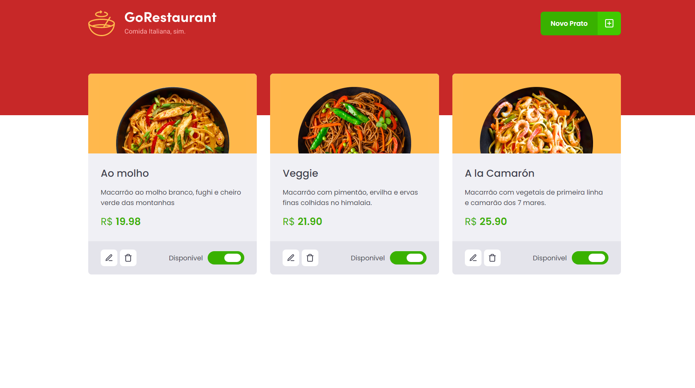
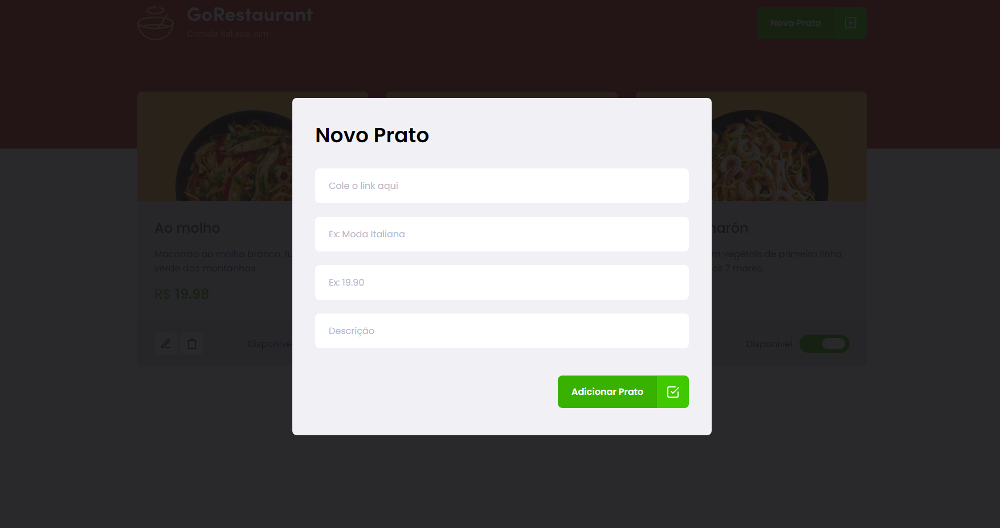
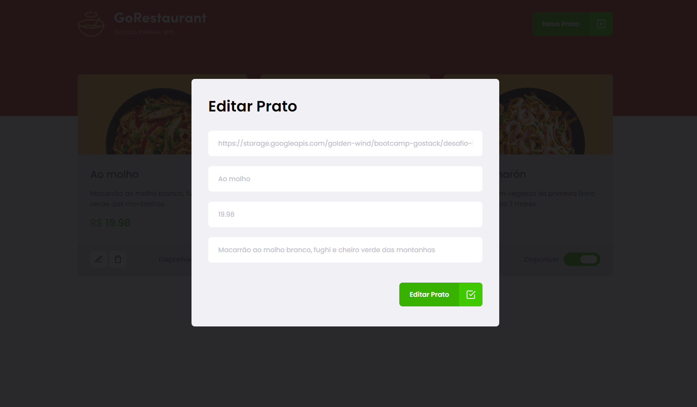

[](https://opensource.org/licenses/MIT)
[](https://choosealicense.com/licenses/mit)
[](https://nextjs.org/)
[](https://github.com/renanlido/goRestaurant/commits)
[](https://rocketseat.com.br)

<!--LOGO-->
<br/>
<div align="center">
    <a href="#">
        
    </a>

<br/><br/>
</div>

<!-- ABOUT THE PROJECT -->
# <strong>Sobre o Projeto</strong>
Este é o projeto de criação de um cardápio virtual de um restaurante e foi feito como desafio complementar no curso [Ignite da Rocketseat](https://rocketseat.com.br).
</br></br>
O desafio visa fazer a refatoração do código passando as classes para funções e transformando todos os componentes em componentes Typescript .
</br></br>
Todo o projeto é baseado em [React.js](https://pt-br.reactjs.org/) e [Typescript](https://www.typescriptlang.org/).

</br>

# <strong>Tecnologias Utilizadas</strong>
### Neste projeto utilizamos: 
<strong>[ReactJs](https://pt-br.reactjs.org/)</strong> : Uma biblioteca JavaScript para criar interfaces de usuário. A tecnologia NextJs roda com ReactJs por baixo dos panos o que nos permite ter flexibilidade de criar e reutilizar componentes além de utilizar a metologia SPA (Single Page Aplication) em algumas páginas do projeto.

<strong>[Typescript](https://www.typescriptlang.org/)</strong> : TypeScript é uma linguagem de código aberto que se baseia em JavaScript, uma das ferramentas mais usadas do mundo, adicionando definições de tipo estático.

</br>

<!--INSTALATION-->

# Instalação

Para instalar e utilizar este projeto o processo é bem simples:
1. Após clonar o projeto utilize o comando:
    ```sh
    yarn
    ```
    Caso não tenha o yarn instalado, utilize o gerenciador de pacotes da sua preferência.            
    

2. Utilize o comando abaixo para rodar o servidor.
    ```ssh 
    yarn server 
    ```
2. Utilize o comando abaixo para rodar o aplicativo.
    ```ssh 
    yarn start 
    ```
</br>

<!--THE RESULT-->

# <strong>O resultado!</strong>


<div>
    </br>
</div>



<div>
    </br>
</div>



<div>
    </br>
</div>

<!-- LICENSE -->

# **Licença**

Distribuído sob a licença MIT. Veja `LICENSE` para mais informações.

<!-- CONTACT -->
</br>

# **Contato**

### Renan Oliveira - **renanlido@yahoo.com.br**

[Github](https://github.com/renanlido) - **https://github.com/renanlido** </br>
[Linkedin](https://www.linkedin.com/in/renanlido/) - **https://www.linkedin.com/in/renanlido/**

</br></br>
Obrigado por ter vindo 😊🤗
